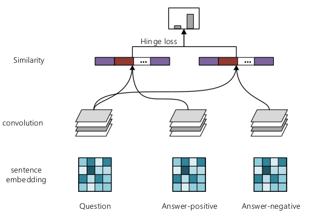
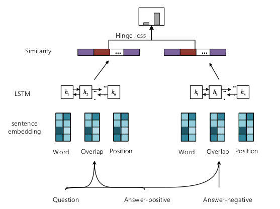

# DBQA: pairwise-based deep model

## Introduction

This task is mainly based on the NLPCC 2017 DBQA task. Given a question and its corresponding documentation, Build a DBQA system to select one or more sentences from the document as a suitable answer.

## Mothods

In this project, we have implemented two models:

1. The first is a pairwise model which based on the CNN representation (CNN_pairwise):

2. The first is a pairwise model which based on the RNN representation, combining position and overlap information (RNN_pairwise):

## Results

We ensemble results of two models(just averaging), ranking 3-th among the 18 submission of our class.
